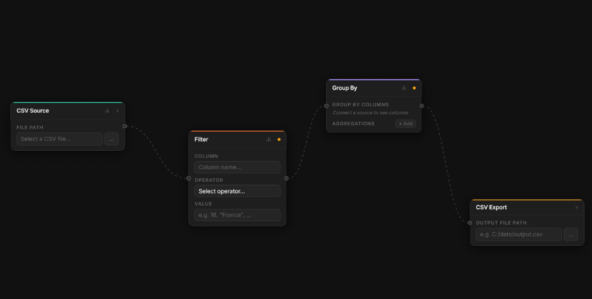

<p align="center">
  
</p>

<h1 align="center">Oxipipe</h1>

<p align="center">
  <strong>Node-based visual data processing (ETL) and data visualization desktop application.</strong>
</p>

<p align="center">
  <a href="LICENSE"></a>
  <a href="https://www.rust-lang.org/"></a>
  <a href="https://v2.tauri.app/"></a>
  <a href="https://react.dev/"></a>
  <a href="https://www.typescriptlang.org/"></a>
  <a href="https://datafusion.apache.org/"></a>
  <a href="https://arrow.apache.org/"></a>
  <a href="https://echarts.apache.org/"></a>
  
</p>

---

<p align="center">
  
</p>

* **Fast:** Powered by Rust and Apache DataFusion for in-memory, multi-threaded data operations.
* **Visual:** Drag-and-drop node canvas to build data transformation pipelines effortlessly.
* **Interactive:** Built-in DataViz studio supporting 20+ chart types (Line, Bar, Scatter, Sankey, Heatmap, Radar, etc.).
* **Native:** Cross-platform desktop application packaged with Tauri and React.

## Quick Start

### Prerequisites

- [Node.js](https://nodejs.org/) (v18+)
- [Rust](https://www.rust-lang.org/) (v1.75+)

### Run in Development

```bash
# Install dependencies
npm install

# Start development mode
npm run tauri dev
```

### Build Executable

To create a standalone desktop application for your OS:

```bash
npm run tauri build
```

## Features

### Data Processing (ETL)
- **Data Sources:** Load CSV, Parquet, JSON, Avro, Excel, and SQLite.
- **Transformations:** Filter, Select Columns, Drop/Fill Nulls, Deduplicate, Rename, Derived Columns, Sort, Top N, Group By, Join, and Union.
- **Data Sinks:** Export pipeline outputs to CSV, Parquet, or JSON.
- **Export Capabilities:** Generate standalone native Rust code or ready-to-run Docker containers.
- **Project Files:** Save and load pipelines as `.oxi` files (`Ctrl+S` / `Ctrl+O`).

### Data Visualization
- **File Support:** Load CSV, JSON, or Parquet datasets directly.
- **20+ Chart Types:** Trends, Distributions, Proportions, Relations, Comparisons, Financial (Candlestick), and Indicators.
- **Customization:** Customize colors, themes, line smoothness, data labels, grid lines, and zoom controls.
- **PNG Export:** Export high-resolution chart images in one click.

## License

Oxipipe is [MIT licensed](LICENSE).
